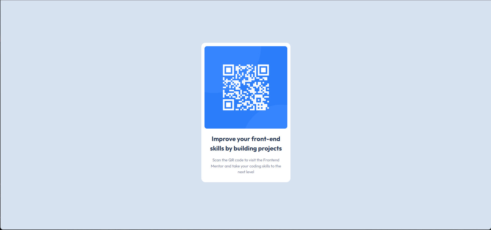

# Frontend Mentor - QR code component solution

This is a solution to the [QR code component challenge on Frontend Mentor](https://www.frontendmentor.io/challenges/qr-code-component-iux_sIO_H). Frontend Mentor challenges help you improve your coding skills by building realistic projects.

## Table of contents

- [UWU](#uwu)
- [Screenshot](#screenshot)
- [Links](#links)
- [Built with](#built-with)
- [Author](#author)

## UwU

### Screenshot

Screenshot of the solution

### Links

- Solution URL: [Add solution URL here](https://www.frontendmentor.io/solutions/qr-code-solution-using-html-and-css-only-aqb_UqO6sk)
- Live Site URL: [Add live site URL here](https://qr-code-component-main-one-ecru.vercel.app/)

### Built with

- Basic HTML5 markup
- CSS

## Author

- Website - [fantasy-programming](https://fantasy-programming.tech)
- Frontend Mentor - [@gamernewone](https://www.frontendmentor.io/profile/gamernewone)
